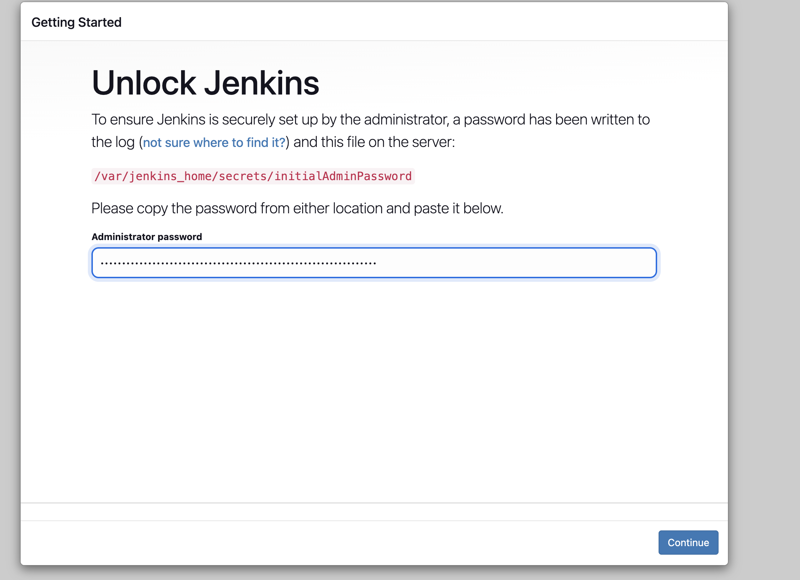
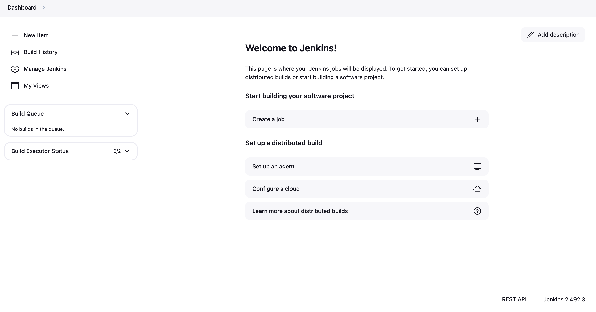
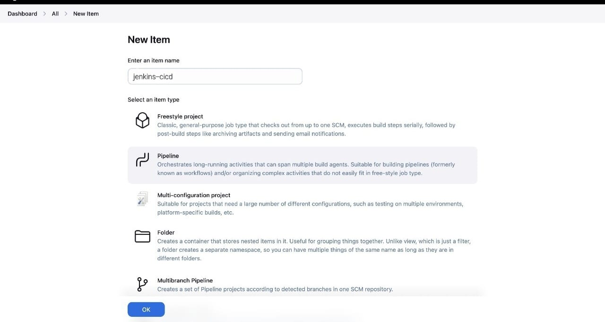
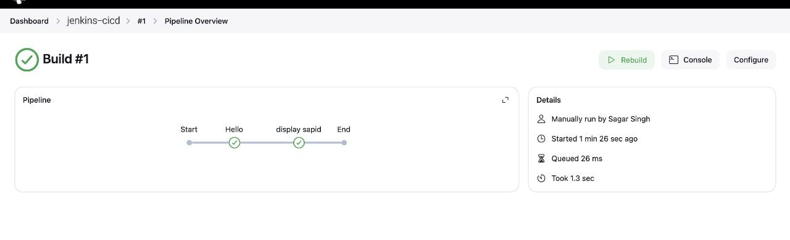
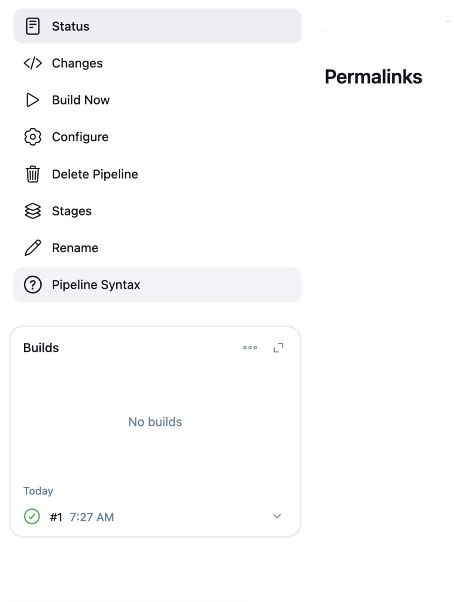

Installed Jenkins on local server. What happened: Jenkins was installed on your local machine (your personal laptop/PC) or on a local network server.
Purpose: Jenkins is an automation server used mainly for building, testing, and deploying software projects.

How: Either by downloading its .war file and running it with java -jar jenkins.war or by using a package manager like brew install jenkins (on Mac) or apt install jenkins (on Linux).

Configured GitHub webhook for Jenkins project. What happened: A webhook was set up inside your GitHub repository’s settings to notify Jenkins whenever there are changes (push events).
Purpose: So that Jenkins automatically knows when someone pushes new code and can start a pipeline without manual action.

How: You went to GitHub repository → Settings → Webhooks → Add webhook → Gave the Jenkins server URL (like http://your-local-ip:8080/github-webhook/) and selected "push events".

Created a Jenkins pipeline job pulling from GitHub. What happened: A new Pipeline project was created inside Jenkins.
Purpose: The job defines what Jenkins should do: pull the code from GitHub, build it, test it, or deploy it.

How: In Jenkins dashboard → New Item → Pipeline → In the configuration, you connected it to the GitHub repo by providing its URL and credentials, and either wrote the pipeline script directly or pointed to a Jenkinsfile in the repo.

Triggered build automatically on GitHub push. What happened: When code was pushed to the GitHub repository, the webhook triggered Jenkins to automatically start the pipeline and execute the steps (build, test, deploy).
Purpose: Fully automated the process — no need to manually tell Jenkins to start the build every time code changes.

 ```bash
   docker run -d -v jenkins_home:/var/jenkins_home -p 8080:8080 -p 50000:50000 --restart=on-failure jenkins/jenkins:lts-jdk17
   ```











